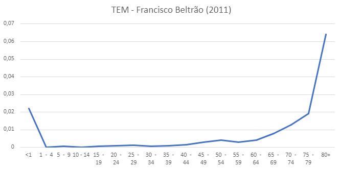

```{=latex}
\setcounter{tocdepth}{4}
\tableofcontents
```

\newpage

```{r setup, include=FALSE}
knitr::opts_chunk$set(echo = TRUE)

library(rio)
library(knitr)
```

```{r, include = FALSE}
DIR <- "DADOS FORNECIDOS/"

CWB_MORTALIDADE <- rio::import(paste0(DIR, "CWB MORTALIDADE.xlsx"))
CWB_FX.ETARIA <- rio::import(paste0(DIR, "CWB FAIXA ETARIA.xlsx"))
CWB_FECUNDIDADE <- rio::import(paste0(DIR, "CWB FECUNDIDADE.xlsx"))

BR_MORTALIDADE <- rio::import(paste0(DIR, "BR MORTALIDADE.xlsx"))
BR_FX.ETARIA <- rio::import(paste0(DIR, "BR FAIXA ETARIA.xlsx"))
BR_FECUNDIDADE <- rio::import(paste0(DIR, "BR FECUNDIDADE.xlsx"))

CR_MORTALIDADE <- BR_MORTALIDADE[,-2]
CR_MORTALIDADE[,2] <- c(6.27, 8.47, 5.32, 7.30, 8.47)

CR_FX.ETARIA <- CWB_FX.ETARIA
CR_FX.ETARIA <- CR_FX.ETARIA[,-2]
CR_FX.ETARIA[,2] <- c(92.59, 112.54, 35.79, 0.46)

CR_FECUNDIDADE <- CWB_FECUNDIDADE
CR_FECUNDIDADE <- CR_FECUNDIDADE[,-2]
CR_FECUNDIDADE[,2] <- c(10.51, 40.90, 0.25)

FB_MORTALIDADE <- CWB_MORTALIDADE
FB_MORTALIDADE[,2] <- c(3.92, 22.71, 3.19, 4.65, 1.45)
FB_MORTALIDADE[,3] <- c(5.66, 10.10, 4.93, 6.39, 1.29)

FB_FECUNDIDADE <- CWB_FECUNDIDADE
FB_FECUNDIDADE[,2] <- c(8.79, 32.69, 0.21)
FB_FECUNDIDADE[,3] <- c(9.25, 35.36, 0.12)

FB_FX.ETARIA <- CWB_FX.ETARIA
FB_FX.ETARIA[,2] <- c(97.83, 114.62, 35.38, 0.55)
FB_FX.ETARIA[,3] <- c(99.88, 110.47, 38.21, 0.48)


```

# Introdução

Este relatório compila os resultados encontrados nas 5 listas realizadas durante o período de 17 de Agosto de 2023 até o dia 21 de Novembro de 2023, e representa 40% da composição total da nota da disciplina CE023 A DEMOGRAFIA ofertada pela prof Nivea da Silva Matuda Machado no perído 2023/2.

# Estrutura Etária

## Costa Rica (2021)

A partir das tabelas de população residentes presentes dispnibilizada na "DEMOGRAPHIC YEARBOOK 2021" foi-se calculada medidas de estrutura etária. Estas medidas foram utilizadas posteriormente para os calculos de mortalidade, fecundidade e natalidade, a tabela a seguir apresentam os calculos realizados:

```{r echo=FALSE, fig.cap="Fonte: Material de Apoio da Disciplina de Demografia - Departamento de Estatística da UFPR"}
knitr::kable(CR_FX.ETARIA, format = "pipe") # Format Pipe nao fez bosta alguma
```

Os gráficos a seguir foram feitos no Excel e importados para o markdown:

\newpage

### Pirâmide Etária

```{r, echo=FALSE, fig.cap="Gráfico de pirâmide para Costa Rica", out.width = '100%'}
 # Mudar isso quando for pro Note
```
Quando comparada a pirâmide etária brasileira do mesmo período vêmos uma pirâmide mais inclinada a um formato oval, indicando uma possível inversão nos próximos anos para Costa Rica, tendência que podemos ver se repetindo no Brasil nos próximos anos.

Não consegui construir uma pirâmide que respeita-se a mesma ordenação do que o mateiral sugerido, isso se dá pela limitação do programa fornecido pela universidade para a construção da visualização

Para a razão de sexo podemos observar o seguinte comportamento:

\newpage

### Razão de sexo

```{r, echo=FALSE, fig.cap="Razão de sexo para Costa Rica (Taxa específica)", out.width = '85%'}

```

Enquanto para o Brasil conseguimos ver uma tendencia monótona na razão de sexo, em Costa Rica têmos um comportamento mais puxado para não monotônica, onde temos a razão variando bastante de uma faixa para outra.

Apesar do valor Brasileiro começar mais alto, em torno de 105, enquanto em Costa Rica em torno de 80, temos uma finalização na faixa de 80+ a situação se inverte, tendo uma razão de sexo maior para Costa Rica.

\newpage

## Francisco Beltrão

A mesma metodologia será feita para a cidade escolhida, no caso, Francisco Beltrão. Os dados foram retirados do DATASUS.

Segue a tabela de medidas para os anos de 2011 e 2021 construídas no decorrer da disciplina:

```{r echo=FALSE}
knitr::kable(FB_FX.ETARIA, format = "pipe") # Format Pipe nao fez bosta alguma
```

\newpage

### Pirâmide Etária 2011

```{r, echo=FALSE, fig.cap="Gráfico de pirâmide para Francisco Beltrão 2021", out.width = '100%'}

```

Apesar de termos uma inversão no eixo y, conseguimos visualizar o mesmo formato de Curitiba, com uma base menor nos 10 primeiros anos, alongada entre 15 até 29 e decrescente deste período em diante. 

\newpage

### Pirâmide Etária 2021

```{r, echo=FALSE, fig.cap="Gráfico de pirâmide para Francisco Beltrão 2021", out.width = '100%'}

```

Comparada a pirâmide de 10 anos antes, temos uma ponta mais "grossa" indicando uma proporção de residentes na faixa dos 75 a 79 anos maior. Quando comparamos com Curitiba temos a mesma tendência de uma distribuição mais homogênea de habitantes.

\newpage

### Razão de sexo 2011

```{r, echo=FALSE, fig.cap="Razão de sexo para Francisco Beltrão 2021", out.width = '100%'}

```

Quando comparada a Curitiba no mesmo ano, vêmos o mesmo padrão, porém em Francisco Beltrão tivemos algumas faixas etárias onde houvem uma diferença, entre 30 a 34 e 75 a 74 houve uma diminuição na Razão de sexo, vêmos também que a razão de sexo é maior para todas as faixas etárias quando comparadas a Curitiba.

\newpage

### Razão de sexo 2021

```{r, echo=FALSE, fig.cap="Razão de sexo para Francisco Beltrão 2021", out.width = '100%'}

```

O padrão se alterou bastante nos 10 anos para esta cidade, conseguimos ver uma estabilidade nos primeiros 45 anos da razão de sexo a cima de 100, quase em 110, indicando uma maioria de cidadãos masculinos, porém a partir desta idade há um rápido decrescimo, padrão que não é observado em Curitiba (2021).

\newpage

# Mortalidade

## Costa Rica

A partir das tabelas de óbito disponibilizada na "DEMOGRAPHIC YEARBOOK 2021" foi-se calculada medidas de óbito por sexo e idade. 

```{r echo=FALSE}
kable(CR_MORTALIDADE)
```

\newpage

### Taxa específica de mortalidade


```{r, echo=FALSE, fig.cap="Taxa Específica de Mortalidade Costa Rica 2021", out.width = '100%'}

```

Para a taxa específica de mortalidade vêmos o mesmo padrão ocorrido no Brasil em 2011, temos uma TEM por volta de 90 na faixa etária de 80+ anos e perto de 20 para <1 anos.

\newpage

## Francisco Beltrão

As mesmas medidas foram calculadas para Francisco Beltrão utilizando dados advindos do DATASUS, a seguir a tabela de medidas:

```{r,echo=FALSE,}
kable(FB_MORTALIDADE)
```


### Taxa de mortalidade Específica 2011

```{r, echo=FALSE, fig.cap="Taxa Específica de Mortalidade Francisco Beltrão 2011", out.width = '100%'}

```

Aqui vêmos uma TEM maior nos primeiros anos, a única diferença apresentada foi na faixa dos 50-54 anos onde no Brasil não foi-se observada esse aumento, para as escalas temos uma TEM maior nas primeiras faixas de idade e menor nas ultimas quando comparada a Curitiba no ano de 2011.

\newpage


### Taxa de mortalidade Específica 2021

```{r, echo=FALSE, fig.cap="Taxa Específica de Mortalidade Francisco Beltrão 2021", out.width = '100%'}

```
Para a TEM de 2021 observamos os mesmos padrões observados em Curitiba, em uma escala muito parecida, o aumento do da TEM observada na faixa de 50 até 54 não foi observada neste ano.

\newpage

## Indice de Sobremortalidade masculina

```{r, echo=FALSE, fig.cap="Indice de sobremortalidade masculina em todas as localidades estudadas", out.width = '100%'}

```

Neste gráfico a escala está divida por 100, porém conseguimos ver o padrão de sobremortalidade masculina alta nos períodos finais da adolescencia em todas as localidades estudadas, padrão que se repete nas análises do Brasil e Curitiba.

\newpage

# Natalidade e Fecundidade

## Costa Rica

A partir das tabelas de nascidos vivos por sexo da criança e idade da mãe, disponibilizada na "DEMOGRAPHIC YEARBOOK 2021" foi-se calculada medidas de natalidade e fecundidade.

```{r,echo=FALSE,}
kable(CR_FECUNDIDADE)
```

\newpage

## Francisco Beltrão

As mesmas medidas foram calculadas para Francisco Beltrão utilizando dados advindos do DATASUS, a seguir a tabela de medidas:

```{r,echo=FALSE,}
kable(FB_FECUNDIDADE)
```

\newpage
## Taxa específica de Fecundidade por idade da mãe

```{r, echo=FALSE, fig.cap="Taxa específica de fecundidade em todas as localidades estudadas", out.width = '100%'}

```

Semelhante no gráfico de sobremortalidade masculina, aqui as taxas estão divididas por 1000, conseguimos ver que Costa Rica tem uma TEF maior para as primeiras faixas etárias do que o Brasil porém um decréscimo mais acentuado em idades apartir de 25 até 29 anos, padrão não observado no Brasil, enquanto Francisco Beltrão e Curitiba continuam com os mesmos padrões, unica excessão é o ano de 2021, que teve uma TEF a baixo do padrão esperado.

# Referência
 
+ MS/SVS/CGIAE, Sistema de Informações sobre Nascidos Vivos (SINASC)
+ United Nations/Department of Economic and Social Affairs/Statistics Division/Demographic Yearbook - 2020

# Dados do Brasil
\includepdf[pages={-}]{"EXEMPLO.PROFESSORA.pdf"}

